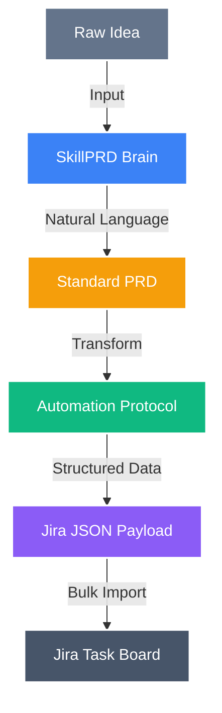

# SkillPRD

A specialized **PRD Skill** to transform raw ideas into implementation-ready Product Requirement Documents.

## How it Works
1. **Discovery**: The AI guides you through 8 key questions to understand your product vision (Intake Check):
    - **1. Product Idea**: 1-2 sentence core concept.
    - **2. Target User**: Who is this for?
    - **3. Core Problem**: What pain point are we solving?
    - **4. Key Feature(s)**: What are the must-have functionalities?
    - **5. User Flow**: Detailed step-by-step journey.
    - **6. Success Goals**: Measurable outcomes for success.
    - **7. Constraints**: Technical, time, or budget limits.
    - **8. Delivery Target**: Who is the primary recipient of this document? (You can also request the **"Full Package"** to generate all 4 targets at once).
2. **Structuring**: It automatically generates a 12-section PRD (User Stories, Functional Reqs, KPIs, Interactive Flows, etc.).
3. **Rendering**: Choose from 4 professional delivery targets or request all 4 in separate code blocks:
    - **Target 1: Standard PRD for Product Lead** (Markdown) - Detailed internal documentation.
    - **Target 2: Technical Blueprint for Engineers** (Markdown) - Technical, logic-heavy specification.
    - **Target 3: UX Interaction Spec for Designers** (Markdown) - Interaction-first specification for designers.
    - **Target 4: Interactive Pitch Deck for Investors** (HTML) - High-impact, 12-slide presentation with advanced UI components.

## How to Use with Other AIs
Once this project is hosted on GitHub, different AI interfaces can consume the **SkillPRD** in the following ways:

### 1. Direct Chat (Gemini, Claude, ChatGPT)
The simplest way to "install" the skill is to copy the entire content of `SKILL.md` and paste it into a new chat session.

> [!TIP]
> Start the message with "You are now following these Skill instructions:" followed by the file content.

### 2. Custom Instructions / System Prompts
If you want the AI to always know how to generate these PRDs:
- Go to the AI's settings (e.g., "Custom Instructions" in ChatGPT or "System Prompt" in Gemini).
- Paste the content of `SKILL.md` there.

### 3. Agentic Tools (Claude Code, Cursor, Windsurf)
If you are using developer-focused AI tools:
- Simply keep `SKILL.md` in your project root.
- Mention `@SKILL.md` or tell the tool to "Follow the logic in `SKILL.md` to generate a product requirement document."

### 4. Shared URL
Since the project is on GitHub, you can provide the **Raw URL** of `SKILL.md` to any tool that supports web fetching or browsing.

### 5. Google Antigravity (Native Skills)
If you are using **Google Antigravity**, this directory is already a fully compliant, native Skill package.
- The Antigravity Agent will automatically detect the `SKILL.md` file (thanks to its YAML frontmatter).
- Simply ask the agent to act as the "PRD Architect" or reference this folder, and it will run the skill's logic systemically.

## File Structure
- `SKILL.md`: The core AI instruction set (Grandmaster Brain).
- `input.yaml`: Blank template with example comments for providing product data.
- `output.html`: The 'Golden Template' used as the blueprint for Pitch Deck generation.
- `examples/`:
    - [Standard PRD for Product Lead](file:///Users/akousist_xml7h/prd-generator/examples/01_Standard_PRD_for_Product_Lead.md)
    - [Technical Blueprint for Engineers](file:///Users/akousist_xml7h/prd-generator/examples/02_Technical_Blueprint_for_Engineers.md)
    - [Interactive Pitch Deck for Investors](file:///Users/akousist_xml7h/prd-generator/examples/03_Interactive_Pitch_Deck_for_Investors.html)
    - [UX Interaction Spec for Designers](file:///Users/akousist_xml7h/prd-generator/examples/04_UX_Interaction_Spec_for_Designers.md)

## Usage
1. Fill in your product details in `input.yaml`.
2. Copy the content of `SKILL.md` into your AI chat (Gemini, Claude, etc.).
3. Paste your `input.yaml` content or let the AI guide you through the Intake Check.
4. The AI will generate the professional PRD in your chosen style, leveraging the centralized logic and templates.

## Workflow Architecture

To streamline the transition from documentation to issue tracking, we've provided a specialized automation skill in the [**/automation**](automation/) directory. This module acts as a bridge to connect your PRD content directly to Jira workflows.

This project defines a complete automation pipeline from "Ideation" to "Engineering Management":

